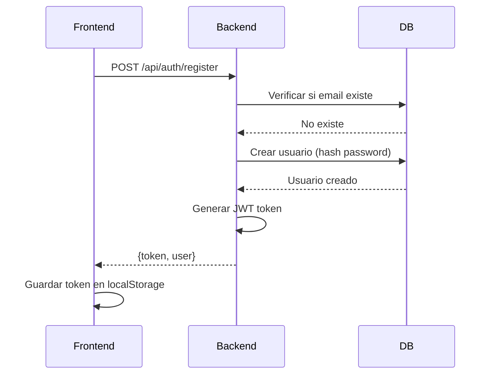
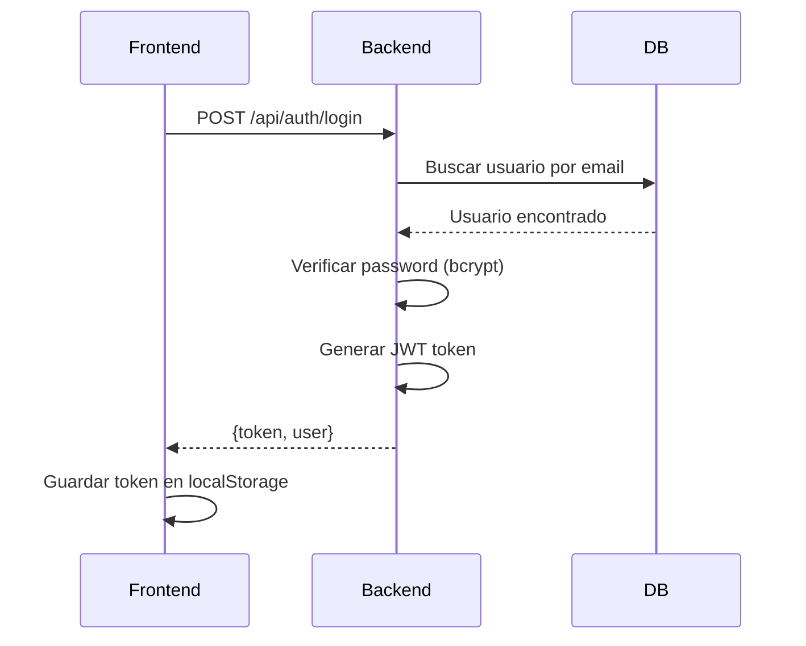
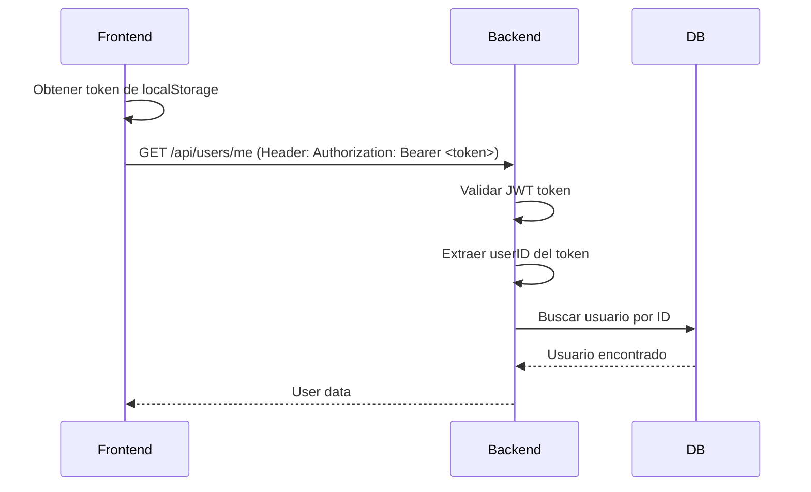

# Lumera API Documentation

**Base URL:** `http://localhost:8080`
**Version:** 1.0
**Authentication:** JWT Bearer Token

## 📚 Índice

- [Autenticación](#autenticación)
  - [POST /api/auth/register](#post-apiauthregister)
  - [POST /api/auth/login](#post-apiauthlogin)
- [Usuarios](#usuarios)
  - [GET /api/users/me](#get-apiusersme)
  - [PUT /api/users/me](#put-apiusersme)
  - [POST /api/users/change-password](#post-apiuserschange-password)
  - [DELETE /api/users/me](#delete-apiusersme)
- [Health](#health)
  - [GET /api/health](#get-apihealth)
- [Modelos de Datos](#modelos-de-datos)
- [Códigos de Error](#códigos-de-error)

---

## Autenticación

### POST /api/auth/register

Registra un nuevo usuario en el sistema.

**Headers:**
```
Content-Type: application/json
```

**Request Body:**
```json
{
  "email": "usuario@ejemplo.com",
  "name": "Nombre Usuario",
  "password": "contraseñasegura123",
  "role": "user"  // Opcional, por defecto "user"
}
```

**Response:** `200 OK`
```json
{
  "token": "eyJhbGciOiJIUzI1NiIsInR5cCI6IkpXVCJ9...",
  "user": {
    "id": 1,
    "email": "usuario@ejemplo.com",
    "name": "Nombre Usuario",
    "role": "user",
    "created_at": "2025-11-22T07:06:18Z",
    "updated_at": "2025-11-22T07:06:18Z"
  }
}
```

**Errores:**
- `400 Bad Request` - Datos inválidos o faltantes
- `409 Conflict` - Email ya registrado
- `500 Internal Server Error` - Error del servidor

**Ejemplo con curl:**
```bash
curl -X POST http://localhost:8080/api/auth/register \
  -H "Content-Type: application/json" \
  -d '{
    "email": "test@lumera.com",
    "name": "Test User",
    "password": "password123"
  }'
```

---

### POST /api/auth/login

Autentica un usuario existente.

**Headers:**
```
Content-Type: application/json
```

**Request Body:**
```json
{
  "email": "usuario@ejemplo.com",
  "password": "contraseñasegura123"
}
```

**Response:** `200 OK`
```json
{
  "token": "eyJhbGciOiJIUzI1NiIsInR5cCI6IkpXVCJ9...",
  "user": {
    "id": 1,
    "email": "usuario@ejemplo.com",
    "name": "Nombre Usuario",
    "role": "user",
    "created_at": "2025-11-22T07:06:18Z",
    "updated_at": "2025-11-22T07:06:18Z"
  }
}
```

**Errores:**
- `400 Bad Request` - Datos inválidos o faltantes
- `401 Unauthorized` - Credenciales incorrectas
- `500 Internal Server Error` - Error del servidor

**Ejemplo con curl:**
```bash
curl -X POST http://localhost:8080/api/auth/login \
  -H "Content-Type: application/json" \
  -d '{
    "email": "test@lumera.com",
    "password": "password123"
  }'
```

---

## Usuarios

> **⚠️ Nota:** Todos los endpoints de usuarios requieren autenticación.
> Incluye el header: `Authorization: Bearer <tu-token-jwt>`

### GET /api/users/me

Obtiene el perfil del usuario autenticado.

**Headers:**
```
Authorization: Bearer <token>
```

**Response:** `200 OK`
```json
{
  "id": 1,
  "email": "usuario@ejemplo.com",
  "name": "Nombre Usuario",
  "role": "user",
  "created_at": "2025-11-22T07:06:18Z",
  "updated_at": "2025-11-22T07:06:18Z"
}
```

**Errores:**
- `401 Unauthorized` - Token faltante o inválido
- `404 Not Found` - Usuario no encontrado

**Ejemplo con curl:**
```bash
TOKEN="tu-token-jwt-aqui"

curl -X GET http://localhost:8080/api/users/me \
  -H "Authorization: Bearer $TOKEN"
```

---

### PUT /api/users/me

Actualiza el perfil del usuario autenticado.

**Headers:**
```
Content-Type: application/json
Authorization: Bearer <token>
```

**Request Body:**
```json
{
  "name": "Nuevo Nombre",       // Opcional
  "email": "nuevo@email.com"    // Opcional
}
```

**Response:** `200 OK`
```json
{
  "id": 1,
  "email": "nuevo@email.com",
  "name": "Nuevo Nombre",
  "role": "user",
  "created_at": "2025-11-22T07:06:18Z",
  "updated_at": "2025-11-22T08:30:00Z"
}
```

**Errores:**
- `400 Bad Request` - Datos inválidos
- `401 Unauthorized` - Token faltante o inválido
- `404 Not Found` - Usuario no encontrado
- `409 Conflict` - Email ya está en uso
- `500 Internal Server Error` - Error del servidor

**Ejemplo con curl:**
```bash
TOKEN="tu-token-jwt-aqui"

curl -X PUT http://localhost:8080/api/users/me \
  -H "Authorization: Bearer $TOKEN" \
  -H "Content-Type: application/json" \
  -d '{
    "name": "Nombre Actualizado"
  }'
```

---

### POST /api/users/change-password

Cambia la contraseña del usuario autenticado.

**Headers:**
```
Content-Type: application/json
Authorization: Bearer <token>
```

**Request Body:**
```json
{
  "current_password": "contraseñaactual",
  "new_password": "nuevacontraseña123"
}
```

**Response:** `200 OK`
```json
{
  "message": "password changed successfully"
}
```

**Errores:**
- `400 Bad Request` - Datos faltantes o inválidos
- `401 Unauthorized` - Token inválido o contraseña actual incorrecta
- `404 Not Found` - Usuario no encontrado
- `500 Internal Server Error` - Error del servidor

**Ejemplo con curl:**
```bash
TOKEN="tu-token-jwt-aqui"

curl -X POST http://localhost:8080/api/users/change-password \
  -H "Authorization: Bearer $TOKEN" \
  -H "Content-Type: application/json" \
  -d '{
    "current_password": "password123",
    "new_password": "newpassword456"
  }'
```

---

### DELETE /api/users/me

Elimina permanentemente la cuenta del usuario autenticado.

**Headers:**
```
Authorization: Bearer <token>
```

**Response:** `200 OK`
```json
{
  "message": "account deleted successfully"
}
```

**Errores:**
- `401 Unauthorized` - Token faltante o inválido
- `500 Internal Server Error` - Error del servidor

**Ejemplo con curl:**
```bash
TOKEN="tu-token-jwt-aqui"

curl -X DELETE http://localhost:8080/api/users/me \
  -H "Authorization: Bearer $TOKEN"
```

---

## Health

### GET /api/health

Endpoint de health check para verificar el estado de la API y la base de datos.

**Response:** `200 OK`
```json
{
  "status": "ok",
  "database": "connected",
  "timestamp": "2025-11-22T07:06:18.361811Z"
}
```

**Ejemplo con curl:**
```bash
curl http://localhost:8080/api/health
```

---

## Modelos de Datos

### User

```json
{
  "id": 1,                              // uint (auto-generado)
  "email": "usuario@ejemplo.com",       // string (único, requerido)
  "name": "Nombre Usuario",             // string (requerido)
  "role": "user",                       // string (default: "user")
  "created_at": "2025-11-22T07:06:18Z", // timestamp
  "updated_at": "2025-11-22T07:06:18Z"  // timestamp
}
```

**Nota:** El campo `password_hash` nunca se incluye en las respuestas JSON.

### AuthResponse

```json
{
  "token": "eyJhbGciOiJIUzI1NiIs...",  // string (JWT token)
  "user": { ... }                       // User object
}
```

### HealthResponse

```json
{
  "status": "ok",                        // string
  "database": "connected",               // string ("connected" o "disconnected")
  "timestamp": "2025-11-22T07:06:18Z"   // timestamp
}
```

---

## Códigos de Error

Todos los errores siguen este formato:

```json
{
  "error": "descripción del error"
}
```

### Códigos HTTP comunes:

| Código | Significado | Cuándo ocurre |
|--------|-------------|---------------|
| `200` | OK | Operación exitosa |
| `400` | Bad Request | Datos inválidos o faltantes |
| `401` | Unauthorized | Token faltante, inválido o credenciales incorrectas |
| `404` | Not Found | Recurso no encontrado |
| `409` | Conflict | Conflicto (ej: email ya registrado) |
| `500` | Internal Server Error | Error del servidor |

---

## Flujo de Autenticación

### 1. Registro de Usuario



### 2. Login



### 3. Uso de Endpoints Protegidos



---

## Regenerar Documentación

La documentación Swagger se genera automáticamente desde los comentarios en el código Go.

**Regenerar docs:**
```bash
make docs
```

**Visualizar:**
- Importa `backend/docs/swagger.json` en https://editor.swagger.io
- O usa Postman: Import → OpenAPI 3.0 → `swagger.json`

**Actualizar docs al agregar nuevos endpoints:**
1. Agrega comentarios Swagger en el handler (ver ejemplos en código)
2. Ejecuta `make docs`
3. Los archivos `swagger.json` y `swagger.yaml` se actualizan automáticamente

---

## Ejemplos Completos

### Flujo completo: Registro → Login → Consultar Perfil

```bash
# 1. Registrar usuario
RESPONSE=$(curl -s -X POST http://localhost:8080/api/auth/register \
  -H "Content-Type: application/json" \
  -d '{
    "email": "demo@lumera.com",
    "name": "Demo User",
    "password": "demo123"
  }')

# 2. Extraer token del response
TOKEN=$(echo $RESPONSE | jq -r '.token')

echo "Token obtenido: $TOKEN"

# 3. Consultar mi perfil
curl -X GET http://localhost:8080/api/users/me \
  -H "Authorization: Bearer $TOKEN"

# 4. Actualizar mi perfil
curl -X PUT http://localhost:8080/api/users/me \
  -H "Authorization: Bearer $TOKEN" \
  -H "Content-Type: application/json" \
  -d '{
    "name": "Demo User Actualizado"
  }'

# 5. Cambiar password
curl -X POST http://localhost:8080/api/users/change-password \
  -H "Authorization: Bearer $TOKEN" \
  -H "Content-Type: application/json" \
  -d '{
    "current_password": "demo123",
    "new_password": "newdemo456"
  }'
```

---

## Contacto

**Equipo Lumera**
Email: info@lumera.com
Proyecto: Platanus Hack 25
